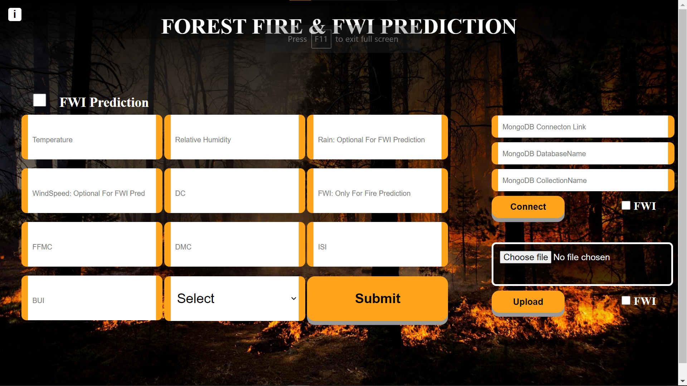

# ML-03-ForestFirePrediction

- Developed a machine learning-based web app for forest fire and Fire Weather Index prediction.
- Performed Feature Selection, Feature Engineering, and voting classifier/Regressor based ensemble techniques.
- Implemented MongoDB and deployed it on Render. Achieved F1 97.14% and accuracy 97.96%
  

